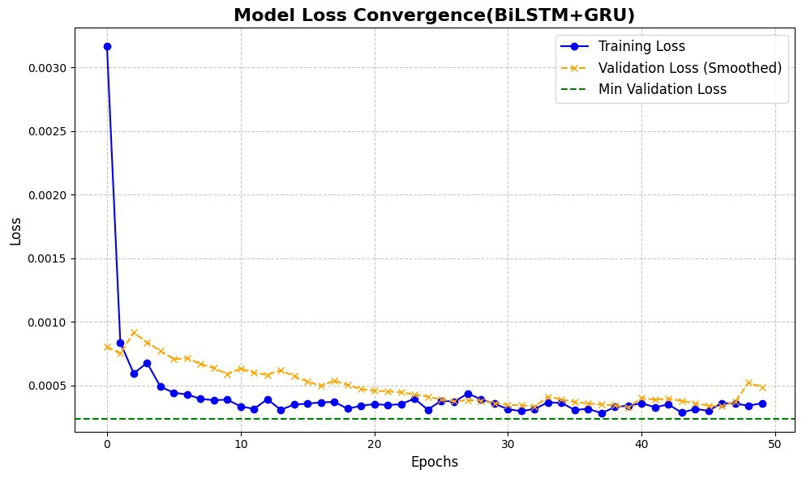
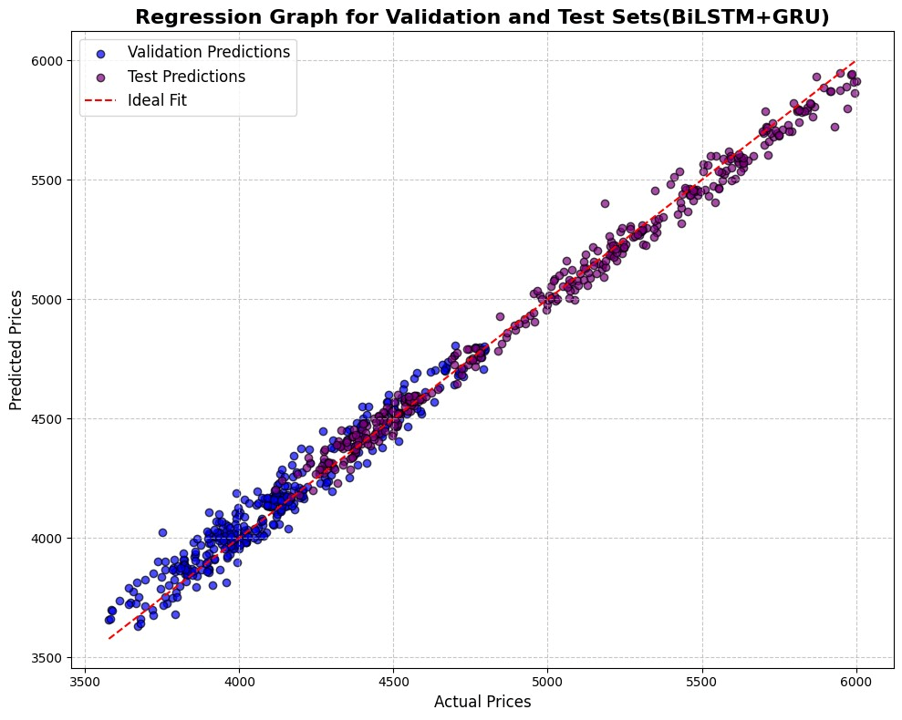
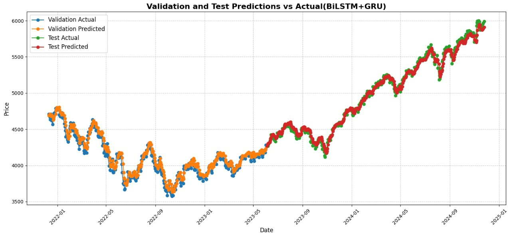

# 📈 Enhanced Stock Market Forecasting Using Hybrid BiLSTM-GRU Model

This project focuses on building an advanced deep learning-based forecasting system using a **hybrid BiLSTM-GRU** model to predict stock market prices. Trained on historical S&P 500 data, our model captures both forward and backward time dependencies to deliver highly accurate predictions.

---

## 🔍 Overview

Forecasting stock prices accurately is crucial for investors and financial institutions. In this work, we experimented with several machine learning and deep learning models including:

- CNN  
- LSTM  
- GRU  
- BiLSTM  
- Random Forest  
- GARCH  
- Transformer (with Attention)  
- **Hybrid models like:** LSTM+CNN+RF, GARCH+LSTM, LSTM+GRU, BiLSTM+GRU

After extensive testing and evaluation, the **BiLSTM + GRU** hybrid model emerged as the most effective solution in terms of accuracy, consistency, and error reduction.

---

## 📊 Dataset

- **Source:** S&P 500 Historical Data  
- **Records:** 2,538 trading days  
- **Features Used:** `Date`, `Open`, `High`, `Low`, `Price`, `Change%`

🖼️ _Suggested image to include: Dataset parameter table (min, max, mean, skewness)_

---

## ⚙️ Model Architecture

The hybrid model architecture includes:

1. Input Layer  
2. BiLSTM Layer (50 units)  
3. Dropout Layer (rate = 0.2)  
4. GRU Layer (50 units)  
5. Dropout Layer (rate = 0.2)  
6. Dense Output Layer  

🖼️ _Suggested image to include: Block diagram of the model (Figure 1)_

---

## 🧪 Evaluation Metrics

The model was evaluated using the following metrics:

- **Root Mean Squared Error (RMSE)**
- **Mean Absolute Error (MAE)**
- **Mean Absolute Percentage Error (MAPE)**
- **R-squared (R²)**

🖼️ _Suggested image to include: Validation vs Predicted Graph (Figure 2), Regression Graph (Figure 3), Convergence Curve (Figure 4)_

---

## 🏆 Performance Summary

| Model           | RMSE    | MAE     | MAPE   | R²     |
|----------------|---------|---------|--------|--------|
| **BiLSTM+GRU**  | 0.0125  | 0.0101  | 0.83%  | 0.9901 |

Compared to other individual and hybrid models, the **BiLSTM-GRU** approach consistently outperformed in all metrics. It demonstrated not only **lower error variance** but also greater **training stability**, confirmed through **statistical F-test analysis**.

---

## 💡 Applications

- Real-time financial forecasting systems
- Trading platforms with low-latency requirements
- Portfolio risk mitigation tools
- Financial analytics dashboards

---

